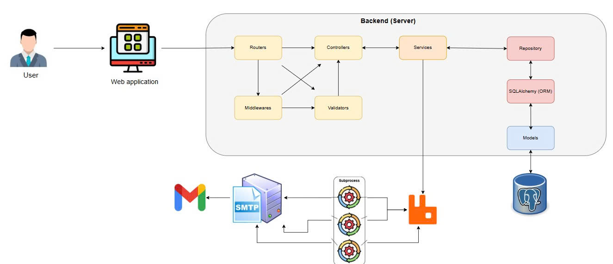

# Base Flask Project

### Architecture Pattern

()

### Commands

**1. Setup environment**
- Create environment file

``` bash
cp .env.example .env

# Update the environment varables as needed
```

**2. Migrate Database**

- Creates a new migration script by detecting changes in SQLAlchemy models:

```bash
FLASK_APP=run.py flask db migrate -m "message" # For Linux
flask db migrate -m "message" # For Windows
```

- Applies the migration scripts to update the database schema to match the latest models:

```bash
FLASK_APP=run.py flask db upgrade # For Linux
flask db upgrade # For Windows
```

- Reverts the database to a previous migration state:

```bash
FLASH_APP=run.py flask db downgrade  # For Linux
flask db downgrade  # For Windows
```

```bash
FLASH_APP=run.py flask db downgrade <revision>  # For Linux
flask db downgrade <revision>  # For Windows
```

Set environment variable (env): `CELERY_BROKER_URL=amqp://localhost` for Flask app.
For starting Celery worker, run command:

```bash
celery -A celery_worker.celery worker --loglevel=info
```

**4. Setting up & Start Flask app**

- Create virtualenv

```bash
python3 -m venv venv
source venv/bin/activate # For Linux
```

```bash
python -m venv venv
venv/Scripts/activate # For Windows
```

- Install the requirements:

```bash
pip install -r requirements.txt
```

- Install pre-commit:

```bash
pre-commit install
```

- Start Flask app on your first terminal window:

```bash
python run.py
```

- You can using docker, docker-compose for setup and run app

```bash
docker-compose up -d
```